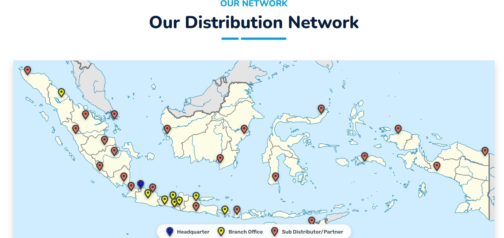

<h1>Corporate Website Modernization: Enhancing Cross-Platform UX and Digital Branding for Enterprise Growth</h1>

<h2>1. Executive Summary & Project Rationale</h2>

Our current corporate website no longer accurately reflects the scale, operational reach, or strategic posture of our organization. Developed in 2020 when our operations were limited to 3 branches, the platform has failed to keep pace with our expansion to 8 branches and our ongoing growth strategy

To drive enterprise growth and modernize our digital footprint, this initiative addresses three core operational challenges:

<ul>
<li>Outdated Brand Representation: The legacy site fails to convey our expanded national footprint, operational scale, and market leadership.</li>
<li>Cross-Platform Incompatibility: With a majority of users accessing our portal via mobile devices, the non-responsive layout severely impairs readability, engagement, and user experience (UX) on smartphones and tablets.</li>
<li>Content Management Friction: Administrative access constraints and legacy asset locks have made routine content updates difficult, hindering timely public communications.</li>
</ul>

To solve these challenges, we have conducted a full corporate information audit and aligned our web development roadmap with a strategic SWOT analysis.

To solved above problem we decided to collect all information about company which should published to others people.

<h2>2. Strategic SWOT Analysis</h2>

<b>Strengths</b>

<ul>
<li>Established Industry Heritage: Over 54 years of distribution excellence and operational resilience (established in 1972).</li>
<li>Exclusive Tier-1 Partnerships: Exclusive distributor for one of the largest pharmaceutical companies in Indonesia.</li>
<li>arket Leadership: Key market leader in high-value medical devices and specialized orthopedic solutions.</li>
</ul>

<b>Weaknesses</b>

<ul>
<li>Constrained Direct Footprint: Fewer physical branch locations compared to major national pharmaceutical competitors.</li>
<li>Geographic Concentration: Operations are heavily concentrated on Java, with only one branch currently established outside the island.</li>
<li>Legacy Structural Evolution: Transitioned into a national distributor during the 1997 Asian Financial Crisis, resulting in legacy operational models that require ongoing digital transformation.</li>
</ul>

<b>Opportunities</b>

<ul>
<lI>Nationwide Distribution Network: Strategic sub-distributor partnerships across major Indonesian cities effectively extend market coverage beyond our 8 core branches.</li>
<li>Asset-Backed Infrastructure: 100% of our active branch facilities are fully company-owned real estate assets.</li>
<li>Logistics & Warehousing Expansion: Ongoing construction of a new, large-capacity central warehouse facility to support increased volume and supply chain demands.</li>
</ul>

<b>Threats</b>

<ul>
<li>Regulatory Compliance: Dynamic healthcare and government regulations requiring continuous compliance and systemic agility.</li>
<li>Rapid Technological Shifts: Accelerating digital trends requiring enhanced, interactive touchpoints for healthcare clients and partners.</li>
<li>Talent Retention: Elevated employee turnover impacting internal operational continuity and institutional knowledge.</li>
</ul>

<h2>3. Core Deliverables & Platform Capabilities</h2>

The modernized corporate website will serve as a centralized digital hub, incorporating the following core capabilities:

<ol>
<li>Fully Responsive Web Design (RWD): An adaptive interface optimized for fluid navigation across desktops, laptops, tablets, and smartphones.</li>
<li>Interactive Corporate Timeline: A visual milestone narrative showcasing our organizational journey from founding in 1972 to the present day.</li>
<li>Interactive Network Map: An interactive map of Indonesia visualizing our company-owned branches alongside our nationwide partner distribution network.</li>
   

      
     
<small>The interactive distributor network map utilizes a scalable vector format, ensuring seamless responsiveness and crisp visuals across all screen sizes and device dimensions. Furthermore, users can hover over individual mapped locations to dynamically reveal branch names and operational details</small>

  

<li>Medical Solutions & Product Catalog: A structured showcase highlighting our complete portfolio of medical devices and orthopedic solutions.</li>
<li>Corporate Media & Activity Hub: A dynamic newsroom featuring company activities, CSR updates, product developments, and industry insights.</li>
</ol>

<h2>4. Technical Architecture</h2>

<ul>
<li>Framework: Built on the Laravel Framework to ensure high performance, enterprise-grade security, and long-term codebase scalability.</li>
<li>CMS Architecture: Integrated with a modern Content Management System (CMS) architecture, enabling intuitive, role-based administrative control and effortless content management for internal teams.</li>
</ul>
 

