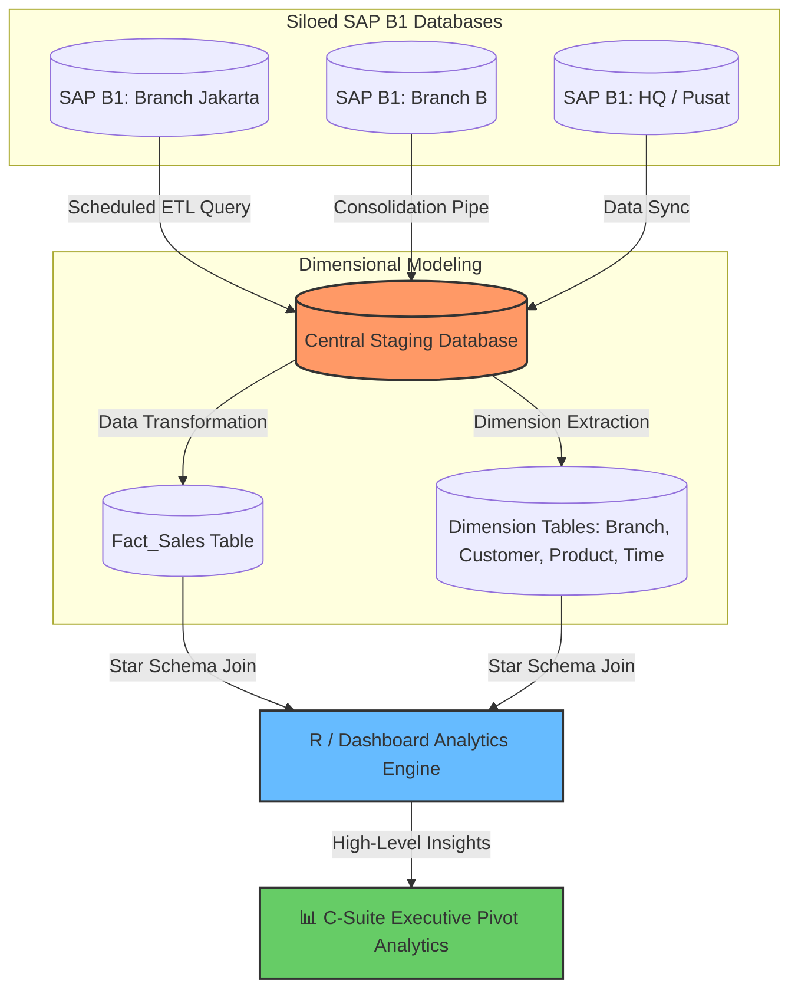

*** Ini contoh mermaid document

```mermaid
graph TD
    %% Database Cabang SAP B1
    subgraph Branch_ERP_Layers [Siloed SAP B1 Databases]
        B1[(SAP B1: Branch Jakarta)]
        B2[(SAP B1: Branch B)]
        B3[(SAP B1: HQ / Pusat)]
    end

    %% Proses ETL ke Staging
    B1 -->|Scheduled ETL Query| STG[(Central Staging Database)]
    B2 -->|Consolidation Pipe| STG
    B3 -->|Data Sync| STG

    %% Proses Transformasi ke Star Schema
    subgraph Data_Warehouse_Model [Dimensional Modeling]
        STG -->|Data Transformation| FT[(Fact_Sales Table)]
        STG -->|Dimension Extraction| DIM[(Dimension Tables: Branch, Customer, Product, Time)]
    end

    %% Lapisan Analisis Executive
    FT & DIM -->|Star Schema Join| BI[R / Dashboard Analytics Engine]
    BI -->|High-Level Insights| Exec[📊 C-Suite Executive Pivot Analytics]

    style STG fill:#f96,stroke:#333,stroke-width:2px
    style BI fill:#6bf,stroke:#333,stroke-width:2px
    style Exec fill:#6c6,stroke:#333,stroke-width:2px
```