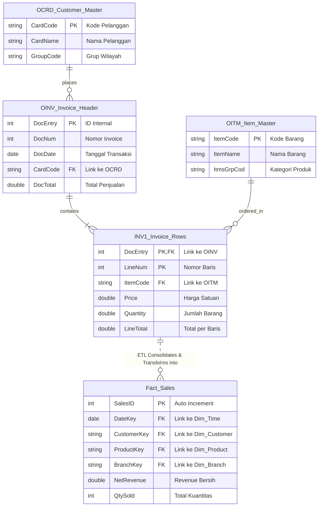

### 📊 SAP B1 Core Tables to Dimensional Star Schema Mapping
The diagram below illustrates the Entity Relationship Diagram (ERD) of the source SAP B1 tables and how they are transformed into a clean, high-performance Star Schema for executive analytics.

---

## 📊 Data Architecture & Dimensional Modeling (ERD)

To achieve a consolidated view of multi-branch operations, the data architecture transitions from an **OLTP (Transactional) environment** native to SAP Business One into an **OLAP (Analytical) Star Schema** housed within the centralized staging database.

The Entity Relationship Diagram (ERD) below outlines the structural mapping and logical pipeline:

### 🧠 Architectural Breakdown & Logic

1. **Source Layer (Standard SAP B1 Schema):** The pipeline ingests operational transactional data straight from standard SAP B1 relational tables (`OINV`, `INV1`) along with master data definitions (`OCRD`, `OITM`) across all branch databases. 
2. **ETL Consolidation:** Custom ETL scripts execute routine schedules to extract, deduplicate, and merge separate multi-branch databases into a unified central staging layer.
3. **Dimensional Layer (Star Schema):** Complex transactional dependencies are flattened into a high-performance Star Schema. The `Fact_Sales` table isolates numerical metrics (Net Revenue, Quantities), while foreign keys link directly to independent dimensions (`Dim_Customer`, `Dim_Product`, `Dim_Branch`, `Dim_Time`). This structured optimization allows executive end-users to perform seamless, instantaneous multi-attribute pivot analytics without straining production ERP resources.

---

### ⚠️ Data Privacy & Legal Compliance Disclaimer
*To ensure absolute compliance with corporate Non-Disclosure Agreements (NDA) and strict data protection standards, this portfolio adheres to the following privacy rules:*
* All tables and structural fields are limited to **globally standardized SAP Business One core schemas**, omitting any company-specific custom tables or internal configurations.
* No real production data, actual financial margins, or real client names are exposed.
* All data points hosted within the `/data` folder are entirely **anonymized, synthetically generated, and randomized** solely for data engineering simulation and pipeline demonstration purposes.

---